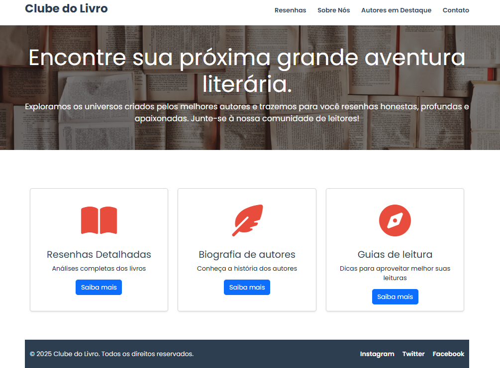
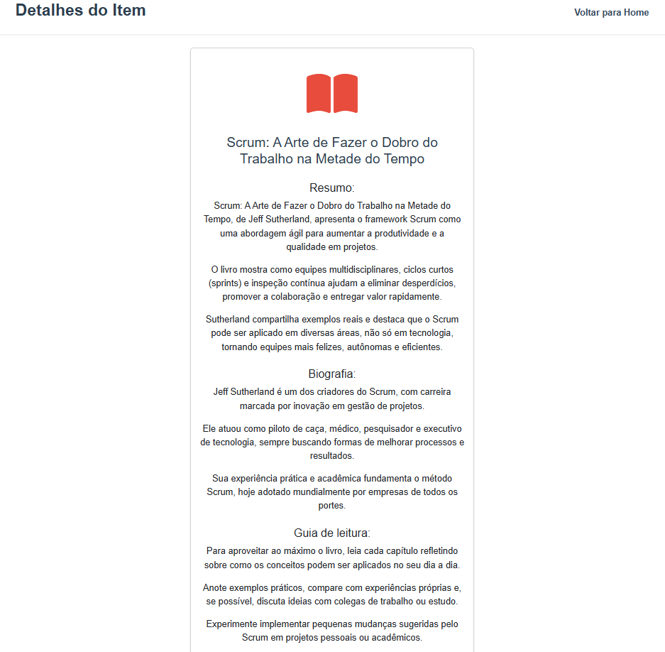
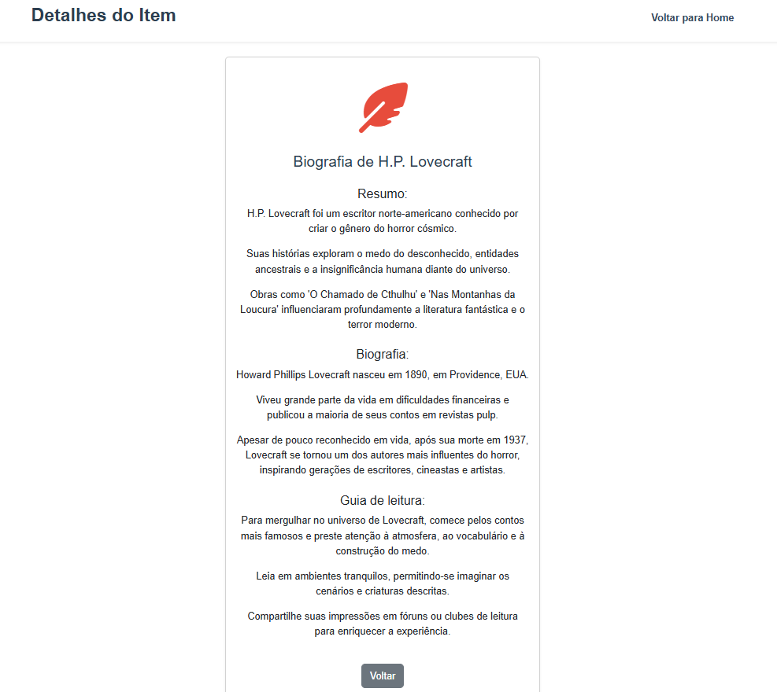
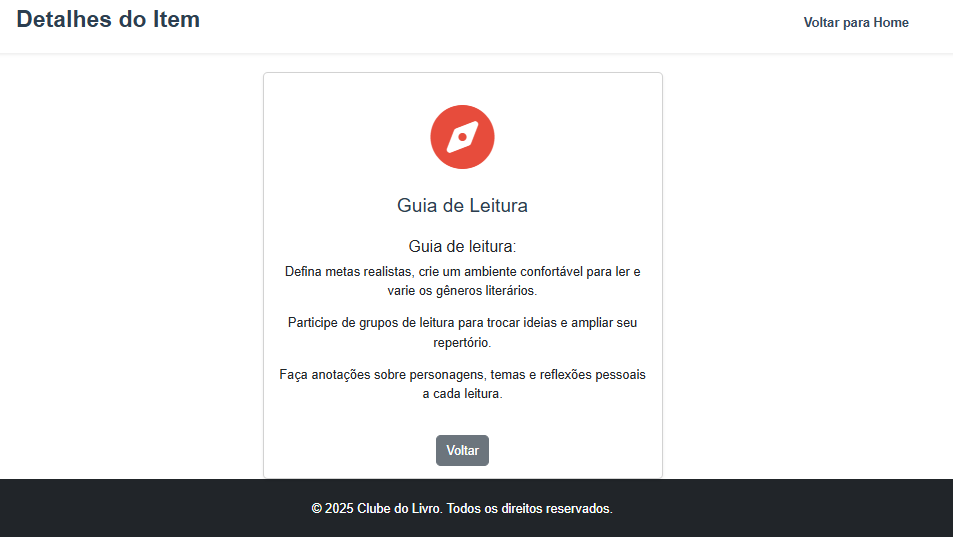

# Trabalho Prático 05 - Semanas 7 e 8

**Páginas de detalhes dinâmicas**

Nessa etapa, vamos evoluir o trabalho anterior, acrescentando a página de detalhes, conforme o  projeto escolhido. Imagine que a página principal (home-page) mostre um visão dos vários itens que existem no seu site. Ao clicar em um item, você é direcionado pra a página de detalhes. A página de detalhe vai mostrar todas as informações sobre o item do seu projeto. seja esse item uma notícia, filme, receita, lugar turístico ou evento.

Leia o enunciado completo no Canvas. 

**IMPORTANTE:** Assim como informado anteriormente, capriche na etapa pois você vai precisar dessa parte para as próximas semanas. 

**IMPORTANTE:** Você deve trabalhar e alterar apenas arquivos dentro da pasta **`public`,** mantendo os arquivos **`index.html`**, **`styles.css`** e **`app.js`** com estes nomes, conforme enunciado. Deixe todos os demais arquivos e pastas desse repositório inalterados. **PRESTE MUITA ATENÇÃO NISSO.**

## Informações Gerais

- Nome:Christiano Gonçalves Araujo
- Matricula:900008
- Proposta de projeto escolhida: ia começar como uma espécie de resumos de livros, o propósito inicial é esse, porém estou desenvolvendo ainda, talvez eu chegue no objetivo.

- Breve descrição sobre seu projeto:Resumo de livros apenas, porem tem uma parte de autores e etc pra nao ficar muito simples, futuramente penso em tirar isso ai, deixar so os resumos e azar, porem como ja está assim, vai continuando

comentário: coloquei tudo em subpastas dentro da pasta public, pra ficar mais organizado.

## Print da Home-Page



## Print da página de detalhes do item





## Cole aqui abaixo a estrutura JSON utilizada no app.js

```javascript
const cards = [
    { 
        id: 1,
        titulo: "Resenhas Detalhadas",
        descricao: "Análises completas dos livros",
        icone: "fa-book-open",
    },
    { 
        id: 2,
        titulo: "Biografia de autores",
        descricao: "Conheça a história dos autores",
        icone: "fa-feather-pointed",
    },
    { 
        id: 3,
        titulo: "Guias de leitura",
        descricao: "Dicas para aproveitar melhor suas leituras",
        icone: "fa-compass",
    },
];

const container = document.getElementById('cards-container');

cards.forEach(card => {
    const cardDiv = document.createElement('div');
    cardDiv.className = 'col-12 col-md-4 mb-4';
    cardDiv.innerHTML = `
        <div class="card h-100 text-center shadow-sm card-hover">
            <div class="card-icon my-3">
                <i class="fa-solid ${card.icone}"></i>
            </div>
            <div class="card-body">
                <h3 class="card-title">${card.titulo}</h3>
                <p class="card-text">${card.descricao}</p>
                <a href="detalhes.html?id=${card.id}" class="btn btn-primary">Saiba mais</a>
            </div>
        </div>
    `;
    container.appendChild(cardDiv);
});
```